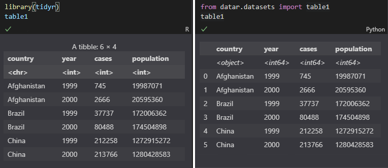

One of the features that I like with `dplyr`/`tidyr` is that the data types are always visible when you print a data frame/tibble out:

```R
> library(tidyr)
> table1
# A tibble: 6 x 4
  country      year  cases population
  <chr>       <int>  <int>      <int>
1 Afghanistan  1999    745   19987071
2 Afghanistan  2000   2666   20595360
3 Brazil       1999  37737  172006362
4 Brazil       2000  80488  174504898
5 China        1999 212258 1272915272
6 China        2000 213766 1280428583
```

But in python (pandas), you only see this:
```python
>>> from datar.all import options
>>> from datar.datasets import table1
>>> options(frame_format_patch=False)
>>> table1
       country  year   cases  population
0  Afghanistan  1999     745    19987071
1  Afghanistan  2000    2666    20595360
2       Brazil  1999   37737   172006362
3       Brazil  2000   80488   174504898
4        China  1999  212258  1272915272
5        China  2000  213766  1280428583
```

If you want to see the data types:
```python
>>> table1.dtypes
country       object
year           int64
cases          int64
population     int64
dtype: object
```

Then how can we display those dtypes under the column names just as `dplyr`/`tidyr` does for tibbles? Here is the expected result:
```python
>>> options(frame_format_patch=True)
>>> table1
       country    year   cases  population
      <object> <int64> <int64>     <int64>
0  Afghanistan    1999     745    19987071
1  Afghanistan    2000    2666    20595360
2       Brazil    1999   37737   172006362
3       Brazil    2000   80488   174504898
4        China    1999  212258  1272915272
5        China    2000  213766  1280428583
```

It looks like this when a data frame is shown in Jupyter Notebook:



To implement this, attaching the dtypes to the column names was the inital thought. However, when it comes complicated when the column names have multiple levels (`MultiIndex` object). So then the idea became to insert the dtypes to the first row of the values.

Digging into the source code of `pandas` `DataFrameFormatter`, the `format_col` is a good place to inject the dtypes:

```diff
def format_col(self, i: int) -> List[str]:
    """Format column, add dtype ahead"""
    frame = self.tr_frame
    formatter = self._get_formatter(i)
+   dtype = frame.iloc[:, i].dtype.name

+   return [f'<{dtype}>'] + format_array(
-   return format_array(
        frame.iloc[:, i]._values,
        formatter,
        float_format=self.float_format,
        na_rep=self.na_rep,
        space=self.col_space.get(frame.columns[i]),
        decimal=self.decimal,
        leading_space=self.index,
    )
```

Then, for the index, we also need to inject a place holder on the same row of the dtypes:

```diff
def get_strcols(self) -> List[List[str]]:
    """
    Render a DataFrame to a list of columns (as lists of strings).
    """
    strcols = self._get_strcols_without_index()

    if self.index:
        #           dtype
+       str_index = [""] + self._get_formatted_index(self.tr_frame)
-       str_index = self._get_formatted_index(self.tr_frame)
        strcols.insert(0, str_index)

    return strcols
```

For `HTMLFormatter`, we also need to increase the `nrows` of a data frame by 1 for the dtypes, for both regular and hierarchical rows, add some styles for the first row, where the dtypes are showing. Fortunately, the `write_tr(...)` method allows us to pass `tags`, which will be added to the HTML tags later on. So we can set the following tags for the dtype rows:

```python
style="font-style: italic;"
```

This will make the dtypes show in italic.
